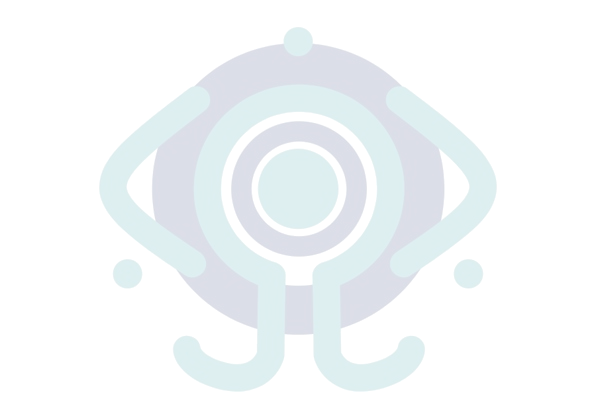

## Hola mundo 👋

<h1>Soy Ariel Paredes Lozada</h1>

Estudiante de ingeniería de software en la <a href="www.uta.edu.ec">Universidad Técnica de Ambato</a> 

<h2>Herramientas</h2>
<table>
  <tr>
    <th colspan="3">
      

      <kbd>Lenguajes de programación</kbd>
      

    </th>
  </tr>
  <tr>
    <th></th>
    <th></th>
    <th></th>
  </tr>
  <tr>
    <th colspan="3">
      

      <kbd>Desarrollo web</kbd>
      

    </th>
  </tr>
  <tr>
    <th></th>
    <th></th>
    <th></th>    
  </tr>
  <tr>
    <th colspan="3">
      

      <kbd>Frameworks</kbd>
      

    </th>
  </tr>
  <tr>
    <th></th>
    <th></th>    
    <th></th>    
  </tr>
</table>
<h2>Proyectos</h2>
<table>
  <tr>
    <th><a href="https://github.com/ArielParedesLozada/Tamagochi-Javascript.git">Tamagochi Web con Javascript</a><th>
  </tr>
  <tr>
    <th><a href="https://github.com/ArielParedesLozada/De-A-a-Z-DS.git">Juego de la A a la Z</a><th>
  </tr>
  <tr>
    <th><a href="https://github.com/ArielParedesLozada/AI-Python.git">Investigación de AI usando Python</a><th>
  </tr>
</table>

## Contactos

<!--
Poner formación acadámica, proyectos, etc.
Investiga cómo hacer un portafolio en GitHub
**ArielParedesLozada/ArielParedesLozada** is a ✨ _special_ ✨ repository because its `README.md` (this file) appears on your GitHub profile.
Here are some ideas to get you started:
- 🔭 I’m currently working on ...
- 🌱 I’m currently learning ...
- 👯 I’m looking to collaborate on ...
- 🤔 I’m looking for help with ...
- 💬 Ask me about ...
- 📫 How to reach me: ...
- 😄 Pronouns: ...
- ⚡ Fun fact: ...
-->